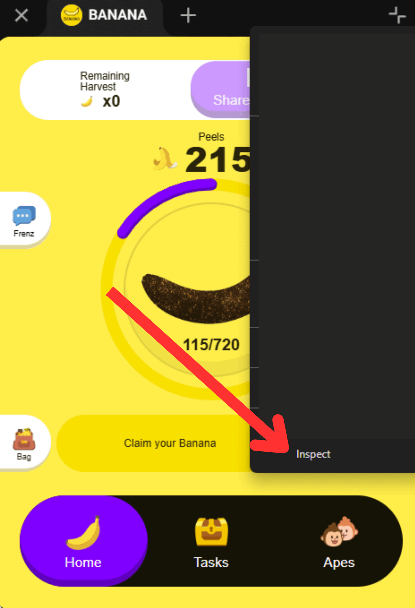

# TG Bot Mining: The Banana Game Auto Click Script

💠The script is randomly auto-clicking the Banana App

💠The script is available on PC & Mobiles

🟩 Register: https://t.me/OfficialBananaBot/banana?startapp=referral=P2E0J5

Script. Both Platforms [PC & Android]
💠Right-click on the app
💠Select "Inspect"
💠Switch to the "Console" tab.
💠Select "Banana..."
💠Enter the code below or copy
💠Press "Enter"

<p align="center">

</p>

# Copy Code & Enter

```bash

const bananaElement = document.querySelector('.banana-image');

// Function to generate random coordinates within the element
function getRandomCoordinates(element) {
  const rect = element.getBoundingClientRect();
  const x = Math.random() * (rect.right - rect.left) + rect.left;
  const y = Math.random() * (rect.bottom - rect.top) + rect.top;
  return { x, y };
}

// Function to get the current and max click values
function getAvailableClicks() {
  const currentClicks = parseInt(document.querySelector('.value').innerText.split('/')[0], 10);
  const maxClicks = parseInt(document.querySelector('.value').innerText.split('/')[1], 10);
  return { currentClicks, maxClicks };
}

// Function to click at random times with adjustable speed
function randomClick(minDelay, maxDelay) {
  const { currentClicks, maxClicks } = getAvailableClicks();

  if (currentClicks < maxClicks) {
    // Get random coordinates within the banana element
    const { x, y } = getRandomCoordinates(bananaElement);

    // Create the click event at the random coordinates
    const clickEvent = new MouseEvent('click', {
      bubbles: true,
      cancelable: true,
      view: window,
      clientX: x,
      clientY: y
    });

    // Dispatch the click event
    bananaElement.dispatchEvent(clickEvent);

    console.log(`Clicked at: (${x}, ${y})`);

    // Set a random delay for the next click between minDelay and maxDelay
    const randomDelay = Math.random() * (maxDelay - minDelay) + minDelay;
    setTimeout(() => randomClick(minDelay, maxDelay), randomDelay);
  } else {
    console.log("No more clicks available!");
  }
}

// Start the random click process with speed control
// Example: 100ms (0.1s) to 300ms (0.3s) delay between clicks 
randomClick(100, 300);


```
